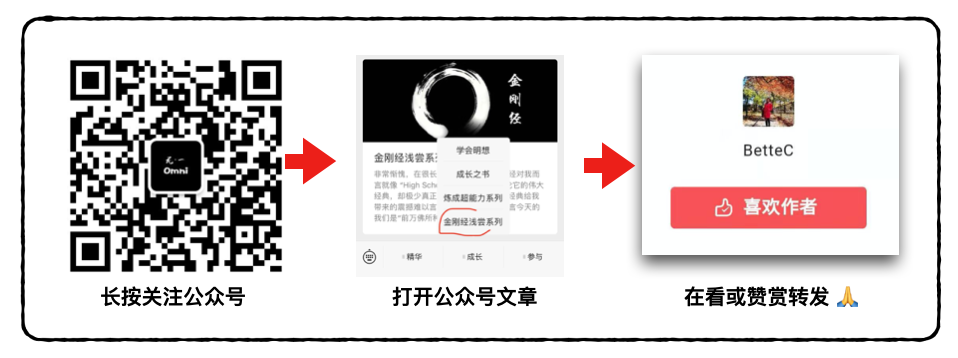

# 首页

《金刚经浅尝》系列最早发布于 Omni 无一 公众号（omniwuyi）。此系列也免费发布于 Gitbook，👇伙伴们可以通过[此网站](https://jingangjing.omnione.live)免费在线阅读。

《金刚经浅尝》所有资源都享受开源知识共享许可版权。

此系列是由 Omni One 公益完成的，如果你觉得此书对你有所启发、有所触动，请关注 Omni One 微信公众号 **omniwuyi，将“金刚经浅尝系列”一文分享于他人 🙏**

Shield: 

This work is licensed under a [Creative Commons Attribution 4.0 International License](http://creativecommons.org/licenses/by/4.0/).

