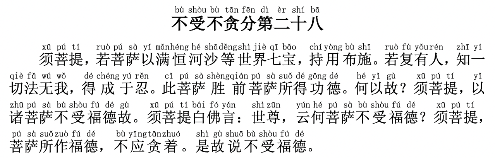

# 【金刚经浅尝】第二十八章 不为福德而布施



（点击👆文件，打开新的页面，然后点`观看` 进行收听\)

释迦摩尼继续告诫大家消极离世不可得，要入世布施修功德，而且还得不留痕迹地修一切善法、发一切善心、做一切善事。接下来我们一句一句地讲解。

**【须菩提，若菩萨以满恒河沙等世界七宝，持用布施。若复有人，知一切法无我，得成于忍。此菩萨胜前菩萨所得功德。】**  
译文：须菩提，如果菩萨用充满恒河沙子那么多的七宝财富用来布施助人。又如果有这样的人，知道一切法都没有我相、人相、众生相和寿者相，大彻大悟修得了大智慧。那么这个菩萨所得的功德要远远超过前面财布施的菩萨。

**所谓“佛”其实是活出了生命本质的样子 - 不断以身作则，不断善行修持功德。许多人修行，其实是为了逃避现实**，有的人是觉得自己没有赚钱的本事、修个行就能有人供养也许就不需要考虑赚钱了，有的人是家里是非烦恼太多、修个行离开是非之地也许就不需要去面对了，有的人是自己品行不行、修个行就能积德让生活顺利了... 这些都不是真正的修行，这连基本做人的品质都不是。

**“一切法无我”**：一切法都没有虚妄相，都不会永远存在、永恒不变。释迦摩尼的教导都是告诉我们什么不是，但是真正的那个境界，是需要我们自己去悟、自己去证、自己去知道什么“是”的。**所以生命真谛、真理并不是个哲学问题，也没有争论对错高低的必要，玄奘法师有句名言很好的解决了这个问题：“如人饮水，冷暖自知”**。

**【何以故？须菩提，以诸菩萨不受福德故。须菩提白佛言：世尊，云何菩萨不受福德？须菩提，菩萨所作福德，不应贪著。是故说不受福德。】**  
译文：这是为什么呢？须菩提，这是因为真正的菩萨并不是为了自己的福德而去布施的。须菩提问佛陀说：佛陀，菩萨为什么不求福报呢？（佛陀说：）须菩提，菩萨布施有福德，但不应该有所求、有所贪念住相。所以说菩萨不受福德。

所谓真正的菩萨，就是行一切善，心无所求，不是为了什么而去助人的。福德与智慧是相辅相成缺一不可的。**成长、成佛是需要提得起、放得下的，提起 - 去修持、去行善、成就福德，放下成就生起大智慧**。

