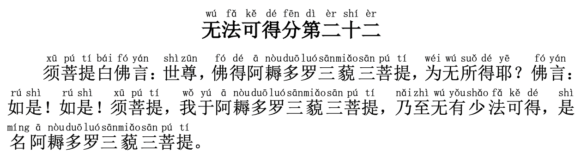

# 【金刚经浅尝】第二十二章 无法可得



（点击👆文件，打开新的页面，然后点`观看` 进行收听\)

上一章释迦摩尼讲无法可说，这一章又进了一步讲无法可得，我们追求真理、追求了悟、追求成长，要知道**真理、了悟、成长都不是个东西，都无法获得，只能自己体会、参透、体验**。接下来我们一句一句地讲解。

**【须菩提白佛言：世尊，佛得阿耨多罗三藐三菩提，为无所得耶？佛言：如是！如是！】**  
译文：须菩提问佛陀说：佛陀，您大彻大悟、成佛、了悟生命的真谛，但实际上并没有得到什么东西，对吗？佛陀说：确实如此，确实如此。

**【须菩提，我于阿耨多罗三藐三菩提，乃至无有少法可得，是名阿耨多罗三藐三菩提。】**  
译文：（佛陀说：）须菩提，我大彻大悟、成佛、了悟生命的真谛，但一点点地所谓佛法或者成佛的东西都没有得到，大彻大悟、成佛、了悟生命的真谛也只是个虚名而已。

了悟真理、得道的人可能看起来还是原来那个人，也许还做着原来的事情（比如小和尚开悟后依旧砍柴、烧水、做饭），但却又不一样了，**这个转变不是物质上的，本来无一物，本来亦无法可得，知道了就是知道了，得道之后也只是自然地体验和传递爱、智慧和力量**。

