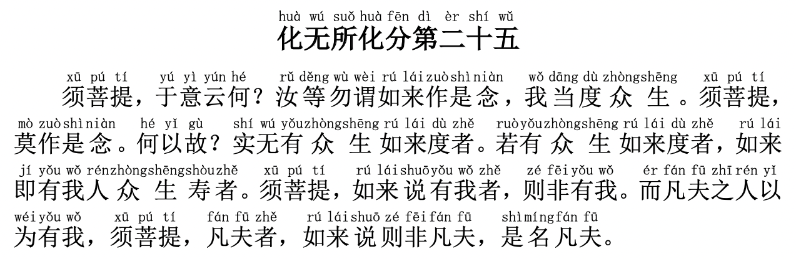

# 【金刚经浅尝】第二十五章 无所度化



（点击👆文件，打开新的页面，然后点`观看` 进行收听\)

贯穿整个金刚经，释迦摩尼的教导都是**善心要发、善法要修、善事要做，但发完、修完、做完还得完全不留痕迹，没有执着妄念，才算圆满完结**。这一章主要是讲度化（或无所度化）的正确姿势。接下来我们一句一句地讲解。

**【须菩提，于意云何？汝等勿谓如来作是念，我当度众生。】**  
译文：（佛陀说：）须菩提，你觉得怎么样呢？你们千万不要认为我说过这样的话，有这样的念头，认为我要度一切众生。

释迦摩尼讲了四十多年的佛法，但他在金刚经里总是教导大家，“如来无有所说法” - 我并没有在讲法，因为**佛法没有定法**，不是呆板的填鸭式教育，都是因材施教，有时是打击、有时是鼓励、有时是启发、有时是让我们难看，无论如何都是刺激我们一下，让我们自己打开自己的大智慧之门，所以没有固定的方式方法。

释迦摩尼之前几章教导大家要发度化众生之心，同样的这里又告诉大家，绝对不要有度化众生的念头。**要有“实无众生得灭度者”的心态** - （内心里认为）没有任何一个众生是我度化的这种胸怀。

**【须菩提，莫作是念。何以故？实无有众生如来度者。若有众生如来度者，如来即有我人众生寿者。】**  
译文：须菩提，千万不要这样想。这是为什么呢？实际上根本没有所谓的众生让我来度化。如果我有这个“我要度化众生”的念头，那么我就不是佛了，我就有了我相、人相、众生相、寿者相了。

“实无有众生如来度者”：释迦摩尼说**没有一个人需要佛来度**！如果作为佛，我认为自己度化了一个人，那么我就不是佛了，因为我就住了四相了。**如果我认为自己是老师，凡夫俗子需要我度化、需要我来救赎，都需要对我毕恭毕敬，那我就绝对不是佛了**。

**【须菩提，如来说有我者，即非有我。而凡夫之人以为有我，须菩提，凡夫者，如来说即非凡夫，是名凡夫。】**  
译文：须菩提，佛说有我，这个“我”是虚妄的，只是为了方便度化众生而起的虚名而已。但凡人以为这个我是真实存在的，须菩提，凡夫与佛都是一样的、都是平等的，佛说凡夫的称号也是虚妄的，只是为了方便度化众生而起的虚名而已。

**佛不是不愿意度人成佛，而是没有办法助人成佛，凡人需要自性自度。**

我们凡人总以为有“我”的存在，有些人以为“我”是肉体，但肉体也是虚妄 - 有生老病死；有些人以为我是“灵魂”，但灵魂也是意识的偶然存在，不是永恒存在的，那也不是真正的“我”。那是不是得追求“无我”追求“空”呢？

无“我”并不等于空，释迦摩尼在金刚经里并没有提到过空，他也没让我们执空消极生活，而只是让我们自己**明白一切都是虚妄 - 都是变幻莫测、并非永恒常在的而已，执着于虚妄，那自然就徒生烦恼了**。

