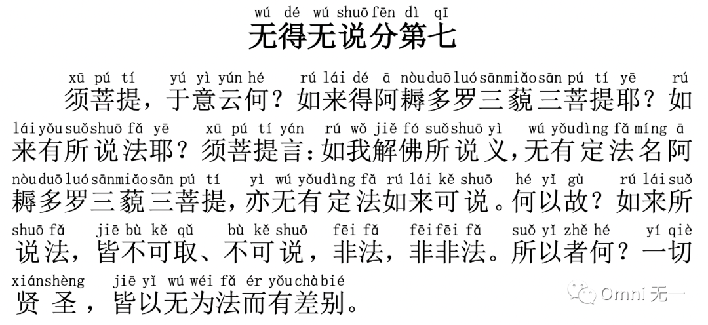

# 【金刚经浅尝】第七章 佛法不可说



（点击👆文件，打开新的页面，然后点`观看` 进行收听\)

释迦摩尼刚仔细地讲解了如何修得大彻大悟成佛的方法，这一章立刻推翻了任何方法和佛法。**如果认为佛陀的文字语言就是佛法和大智慧本身，那就大错特错了。**如果我跟你描述某家餐馆某道菜味道特别好、如何的好，我的描述并非这道菜本身，你知道了也并不等于品尝过这道菜、体悟了菜的味道，佛法亦是如此。接下来我们一句一句的讲解。

**【须菩提，于意云何？如来得阿耨多罗三藐三菩提耶？如来有所说法耶？】**  
译文：（佛陀问：）须菩提，你觉得怎么样？你认为我大彻大悟成佛是得到了什么东西吗？我平常有讲经讲法吗？

**【须菩提言：如我解佛所说义，无有定法名阿耨多罗三藐三菩提，亦无有定法如来可说。】**  
译文：须菩提回答说：据我所学所悟的佛法道理，并没有一个定法叫佛法，佛陀也没有固定的方式来讲法。

**“定法”**：佛陀讲法，并非呆板的填鸭式教育，都是因材施教，有时是打击、有时是鼓励、有时是启发、有时是让我们难看，无论如何都是刺激我们一下，让我们自己打开自己的大智慧之门，所以没有固定的方式方法。佛、或者生命真谛其实在我们的生活中无所不在，我们周围所有的人都有佛、生命真谛的影子，我们遇到的任何事情都有佛、生命真谛的影子，事事人人都能为我们带来启发，让我们看到自己。**那个你讨厌的人，那个你吵过的架，那场你生过的病，无不是如“明镜”般照出我们的我相、人相、众生相和寿者相**。

**【何以故？如来所说法，皆不可取、不可说，非法非非法。】**  
译文：这是为什么呢？佛陀所说的法，你也不可以抓取，执着于他说法的表面意思，说的出来的就不是佛法了，佛法没有固定的说法，但也不是没有固定的说法。

释迦摩尼貌似把自己一生讲法做了一个否定，但其实也不然。他告诫弟子不能执着他说的任何一句话，领悟意会于心就可以了，不应该重复或者按照字面意思去执行。所以我们在这里分享《金刚经浅尝》呢，也不可取。

**【所以者何？一切贤圣，皆以无为法而有差别。】**  
译文：这是什么理由呢？佛法承认一切宗教开悟大师，古往今来一切圣贤，一切宗教的教主都是得道而悟道，获得真理而成功的，只是每个人程度深浅不同，在不同时间、不同地点传播生命的真谛，因此他们所教化、所传递给大家的表达方式不同而已。

真正的佛法、生命的真谛能包含一切，萨古鲁（Sadhguru）说的在道上吗？克里斯那穆提（Krishnamurti）呢？Yoshihide Uezu 老师说的是生命真谛吗？麦克唐纳·贝恩博士呢？耶稣呢？Eckhart Tolle 呢？**如果你觉得修行走的是独木桥，只能跟随某个上师、用某种姿势，那就如盲人摸象，你摸到了大象的尾巴，认为大象就是长长的，你说的没有错，但又不全对，也并没有领悟佛、生命真谛包容万象的境界**。

**“一切世间法，皆是佛法”** - 生命真谛、佛法不是只在佛经里，同样的也不是只在我们接触过的上师那里，而是无处不在。**修炼佛法、生命成长也不一定要脱离人世，只要一念在道上**，不管是做生意、各种生活方式，都可以入世修行，强迫自己或者他人必须要脱离家庭、跑去深山老林、追逐某个上师，也是不可取的。**当然因此而放纵生活、丝毫不精进成长，亦不可取**。

